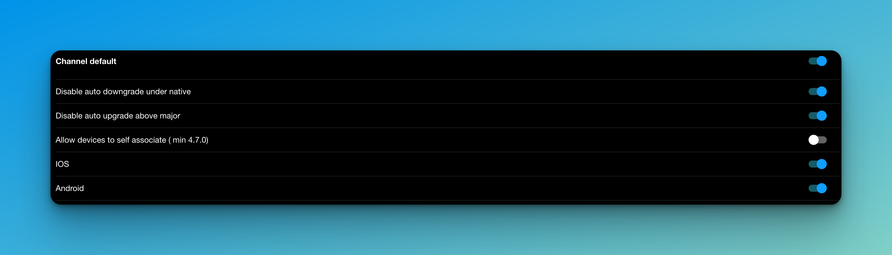

# Channel system

With Capgo and capacitor-updater come a powerful channel system.\

## What you can do with channels:

* Associate devices to channel for developement, beta test or AB testing
* Use one channel by dev branch and let your team self assign from they phone to test

## You have 3 ways to assign device to channel:

* Make the channel default, each time a new device ask capgo for update this one answer
* Send the deviceId to your backend and send from your backend to Capgo the assign order
* Make the channel self assignable, and let the device subcribe to channel ( with user interaction or not)


You can also for specific case assign device directly to a bundle, in debug purpose for exemple.


## Channel options

<figure><figcaption></figcaption></figure>

Meaning of each:

* **Disable auto downgrade under native** => capgo channel don't send update if the app native version is bigger than the channel one
* **Disable auto upgrade above major** => capgo channel don't send update if the app native version is lower from a Major (**1**.2.3) than the channel one
* **Allow device to self assign** => let a device use the setChannel method to this channel
* **IOS** => allow ios devices to download update from this channel
* **Android** => Allow android devices to download update from this channel

