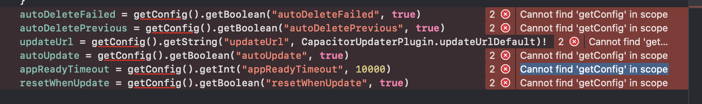

# Know issues

## Ionic live reload

* When you develop, if you use the Ionic live reload feature from the CLI, it will override the plugin, so you will never see your update.

## Quasar live reload

* it use the same system as ionic under the hood, so you will not see your updates.

## Update fail

* Big app update (> 20mb) will have a big percentage of user who doesn't get the last version.  In the past Users need to keep the app open until download is done, now we use background download, but it's still limited to few seconds.

## Android

### Self-hosted

Then you self-hoest update, be mindfull you cannot use "http" endpoint it's again the security rule of Android apps, if you wan to try it follow this guide:



Unzip issue. if you zipped your bundle with window the format could be incorect, please use the CLI command or ZIP with linux.

## Build

### Clearfix issue

* if you have issue with usesCleartextTraffic, it's because the plugin follow the good practice recommended by sonar cloud, in 90 % of the case it will work, but with some plugin that cause issue.

To fix it add in `android/app/src/main/AndroidManifest.xml` in the `<application>` key :

```xml
tools:replace="android:usesCleartextTraffic"
xmlns:tools="http://schemas.android.com/tools"
```

## IOS

## Build

### GetConfig

This problem happen when your app use capacitor 3 with Capgo 4, upgrade your app to v4 or use Capgo v3 ( not recommended it's deprecated and soon will not work)

<figure><figcaption></figcaption></figure>

## CLI

if your CLI has trouble to do the basic action,

Check if **appId** and **appName** are present in your **capacitor.config.ts**

Follow the guidance of the official doc:


