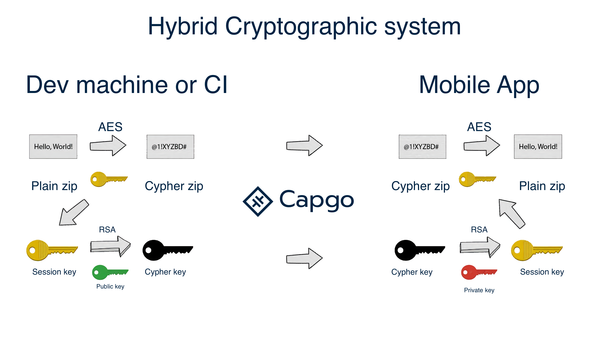

# CLI

### Usage

All command should be run in your app folder with capacitor project ignited. See below

[Capacitor: Cross-platform native runtime for web apps](https://capacitorjs.com/docs/getting-started)

### **Login**

`npx @capgo/cli login [apikey]`&#x20;

This method is here to remember the `apikey` for you.&#x20;


use `--apikey=********` in any command to override it


**Optionnaly you can give:**

`--local` This will store your **apikey** in the local repo and git ignore it.&#x20;

### **Add app**

`npx @capgo/cli add [appId]`&#x20;

`[appId]` your app ID the format `com.test.app` is explained [here](https://capacitorjs.com/docs/cli/init).

> 💡 All option will be guessed in your config if not provided.

Optionally, you can give:

* `--icon [/path/to/my/icon]` to have a custom icon in the list.
* `--name [test]` to have a custom name in the list.
* `--apikey [key]` API key to link to your account.

Example of capacitor.config.json for appId and AppName, the icon is guess in the resources folder

```json
{
  "appId": "ee.forgr.capacitor_go",
  "appName": "Capgo",
  "webDir": "dist",
}
```

### Upload **version**

`npx @capgo/cli upload [appId]`&#x20;

`[appId]` is your app ID the format is explained [here](https://capacitorjs.com/docs/cli/init).

Optionally, you can give:

* `--apikey [key]` API key to link to your account.
* `--path [/path/to/my/app]` to upload a specific folder.
* `--channel [test]` to upload to a specific channel.
* `--external [https://mydomain.com/myapp.zip]` to link to an external URL instead of upload to Capgo cloud, it should be a zip URL in HTTPS.
* `--key [/path/to/my/private_key]` the path of your private key.
* `--key-data [privateKey]` the private key data, if you want to use inline.
* `--no-key` to ignore signing key and send clear update.
* `--bundle [1.0.0]` to set the bundle version number of the file to upload.
* `--iv-session-key [key]` to send a custom session key to the cloud.

> ⭐️ External option help to unlock 2 cases: corporate with privacy concern, don't send the code to a third part and app bigger than 30 MB. With this setting, Capgo store only the link to the zip and send the link to all app.

> 👀 Capgo cloud never look of what is in the link (for external option), or in the code when stored.&#x20;

> 🔑 You can add a second layer of security by using encryption, then Capgo will not be able to look or modify anything, it becomes “trustless”.

Example of package.json for version

```json
{
 "version": "1.0.2"
}
```

> ⛔ Version should be greater than “0.0.0”.

> 💡 Don't forget to update the version number each time you send one, or device will don't see the update.

### **Configure channel**

`npx @capgo/cli set [appId] --channel dev`&#x20;

`[appId]` is your app ID the format is explained [here](https://capacitorjs.com/docs/cli/init).

Optionally, you can give:

* `--bundle [1.2.3]` your app bundle already sent to the cloud, to link it to a channel.
* `--latest` get the bundle version from `package.json:version`, cannot be used with `--bundle`.
* `--state [ normal | default ]` set the channel state, can be `normal` or `default`. One channel need to be `default`.
* `--downgrade` allow the channel to send downgrade version to devices.
* `--no-downgrade` disallow the channel to send downgrade version to devices.
* `--upgrade` allow the channel to send upgrade (major) version to devices.
* `--no-upgrade` disallow the channel to send upgrade (major) version to devices.
* `--ios` allow the channel to send version to iOS devices.
* `--no-ios` disallow the channel to send version to iOS devices.
* `--android` allow the channel to send version to android devices.
* `--no-android` disallow the channel to send version to android devices.
* `--self-assign` allow devices to self assign to this channel.
* `--no-self-assign` disallow devices to self assign to this channel.
* `--apikey [key]` API key to link to your account.

### **List versions**

`npx @capgo/cli list [appId]`&#x20;

`[appId]` your app ID the format `com.test.app` is explained [here](https://capacitorjs.com/docs/cli/init).

Optionally, you can give:

* `--apikey [key]` API key to link to your account.

### **Delete package or version to Cloud**

`npx @capgo/cli delete [appId]`

`[appId]` your app ID the format `com.test.app` is explained [here](https://capacitorjs.com/docs/cli/init).

Optionally, you can give:

* `--apikey [key]` API key to link to your account.
* `--bundle` with the version number will only delete this version.

### Cleanup older packages in a SemVer range for a major version to Cloud

`npx @capgo/cli cleanup [appId] --bundle=[majorVersion] --keep=[numberToKeep]`

`[appId]` your app ID the format `com.test.app` is explained [here](https://capacitorjs.com/docs/cli/init).

Optionally, you can give:

* `--apikey [key]` API key to link to your account.
* `--bundle [majorVersion]` a version you wish to remove previous packages for, it will keep the last one + numberToKeep.
* `--keep [numberToKeep]` the number of packages you wish to keep (default 4).

For example: If you have 10 versions, from 10.0.1 to 10.0.11, and you use `npx @capgo/cli cleanup [appId] --bundle=10.0.0` it will remove 10.0.1 to 10.0.6. 10.0.7 untill 10.0.11 will be kept.

This command will show a list of what it will be removing and ask for confirmation.

## End-to-End encryption (Zero trust)

Capgo support end-to-end encryption, this mean that your code is encrypted before send to the cloud and decrypted on the device. For that, you need to generate an RSA key pair, you can use the following command to generate it.

The encryption system is a combination of RSA and AES, the RSA key is used to encrypt the AES key, and the AES key is used to encrypt the file.

See below for more information about the encryption system.

<figure><figcaption><p>Ecryption schema</p></figcaption></figure>

### Create key for your app

`npx @capgo/cli key create`

Optionally, you can give: `--force` to overwrite the existing key. This command will create for you a key pair in your app, and will ask you to save the private key in a safe place. It's recommended to not git commit the private and public key, and to not share it with anyone.

### Save key in your app config

`npx @capgo/cli key save`

Optionally, you can give: `--key [/path/to/my/private_key]` the path of your private key. `--key-data [privateKey]` the private key data, if you want to use inline. This command is useful if you followed the recommendation and didn't commit the key in your app, and in the config.

### Encrypt zip with your key

`npx @capgo/cli encrypt [path/to/zip]` Optionally, you can give: `--key [/path/to/my/private_key]` the path of your private key. `--key-data [privateKey]` the private key data, if you want to use inline. This command is use when you use external source to store your code or for test purpose. The command will print your ivSessionKey and the encrypted zip, you can use it with the `--iv-session-key` and `--external` option of the `upload` command, or for decrypting the zip.

### Decrypt zip with your key

`npx @capgo/cli encrypt [path/to/zip] [ivSessionKey]`

Optionally, you can give: `--key [/path/to/my/private_key]` the path of your private key. `--key-data [privateKey]` the private key data, if you want to use inline. This command is mainly used for test purpose, it will decrypt the zip and print the base64 decrypted session key in the console.

### Ci integration

To automate your work, I recommend you make GitHub action do the job of pushing to our server

[GitHub action tutorial](https://capgo.app/blog/automatic-build-and-release-with-github-actions)

### Our demo app

[GitHub - Cap-go/demo-app](https://github.com/Cap-go/demo-app)

Don’t forget to configure CI env variable with your API key
